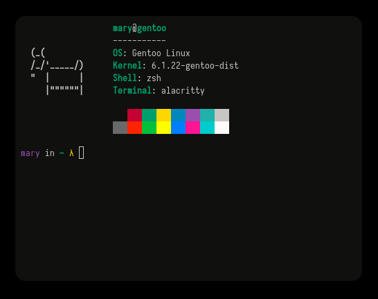

# goatfetch
tiny sys fetch for linux in go(at)  



# compile and run
ensure you have `git` and `go` installed 
```
git clone https://github.com/ntscpal/goatfetch.git
cd goatfetch
go build goatfetch.go
./goatfetch
```
